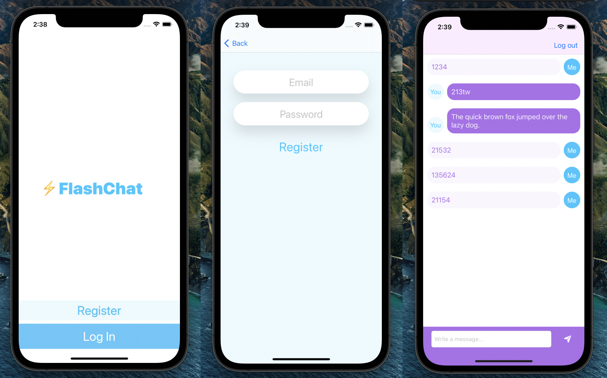

# Flash-Chat

A minimalistic iOS instant messaging app developed with Swift 5.

Uses Firebase for authorization and storing data. Employs the MVC and Delegation development patterns. The messages are stored in the cloud Firestore and are updated automatically in real time.

Available for iOS 13.0 and later.

